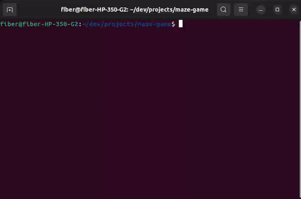

# Maze Game



Maze Game is a simple text-based game implemented in Go. It generates mazes using the Recursive Backtracking algorithm and lets players navigate through the maze to reach the gate (exit). The objective is to reach the gate before running out of time.

## Table of Contents

- [Features](#features)
- [Prerequisites](#prerequisites)
- [Installation](#installation)
- [How to Play](#how-to-play)
- [Contributing](#contributing)
<!-- - [License](#license) -->

## Features

- Random maze generation using the Recursive Backtracking algorithm.
- Player navigation with arrow keys ( `↑` , `→` , `↓` , `←` ) or `W`, `D`, `S`, `A` keys.
- Difficulty levels: easy, medium, and hard.
- Timer to add a time-based challenge.
- Visually appealing ASCII characters to represent walls, the player, and the exit.
- Dynamic placement of the gate to make it as far as possible from the starting position.

## Prerequisites

To run this game, you need to have Go installed on your system. You can download and install Go from the [official website](https://go.dev/dl/).

## Installation

1.  Clone the repository to your local machine:

    ```sh
    git clone https://github.com/abdullah-alaadine/maze-game.git
    ```

2.  Navigate to the project directory:

    ```sh
    cd maze-game
    ```

3.  Build the game:

    ```sh
    go build
    ```

4.  Run the game:

    ```sh
    ./maze-game
    ```

## How to Play

- Use the arrow keys ( `↑` , `→` , `↓` , `←` ) or the `W`, `D`, `S`, `A` keys to move the player.
- Your objective is to reach the gate before the timer runs out.
- You can modify the time limit by providing a time in seconds for the `-time` flag when running the game. For example:

    ```sh
    ./maze-game -time=120
    ```

  This command sets the time limit to 2 minutes (120 seconds) // the default value is 1 min (60 seconds)
- Different difficulty levels (easy, medium, hard) offer mazes of varying complexity.
- You can exit the game by pressing on `q` key on the keyboard.

## Contributing

Contributions are welcome! If you have any ideas, bug fixes, or improvements, please submit an issue or a pull request.
